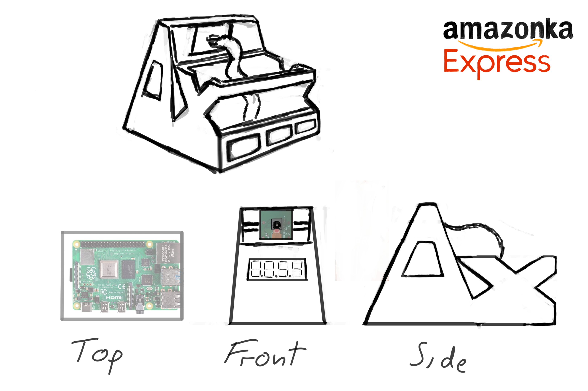

# amazonka-express-soft

# Rysunek koncepcyjny
<!--  -->


## Opis projektu

Jednym z problemów w dzisiejszych realiach jest znalezienie najlepszego sposobu na naukę zdalną.
Nasz zespół ma zamiar stworzyć urządzenie, które poradzi sobie z tym trudnym zadaniem!

**Amazonka-Express-Box** wspomaga skupienie uwagi studenta na zdalnych wykładach.

Za pomocą kamery wbudowanej lub kamery zewnętrznej śledzi ono ruch gałek ocznych i wznosi drażniący 
dla studenta alarm dźwiękowy. 

### Opis struktury projektu

- **doc** - dokumentacja projektu
- **lib** - zewnętrzne biblioteki
- **src** - kod źródłowy projektu
- **tests** - testy jednostkowe kodu źródłowego

### Sposob uruchomienia

python3:

```python
python3 main.py
```
